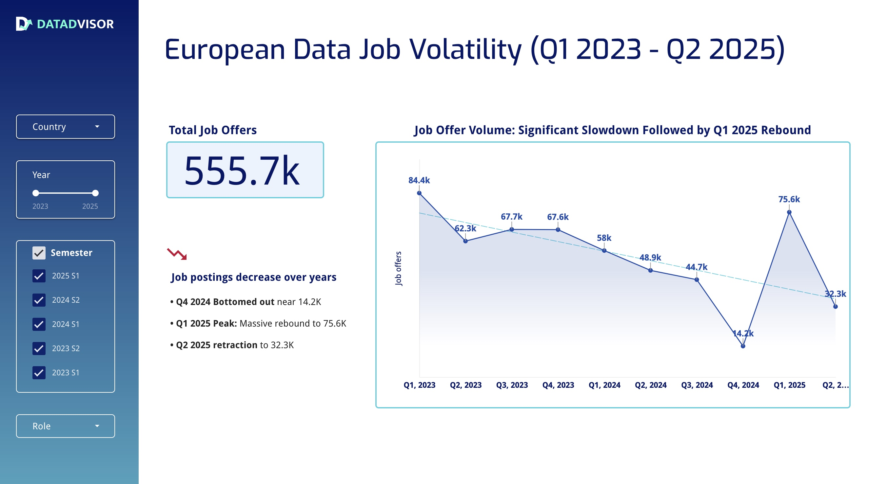
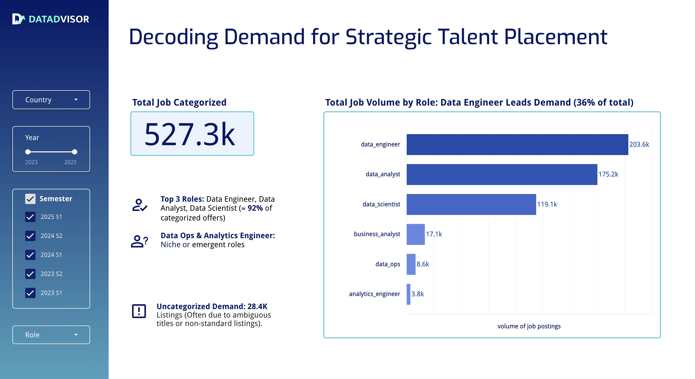
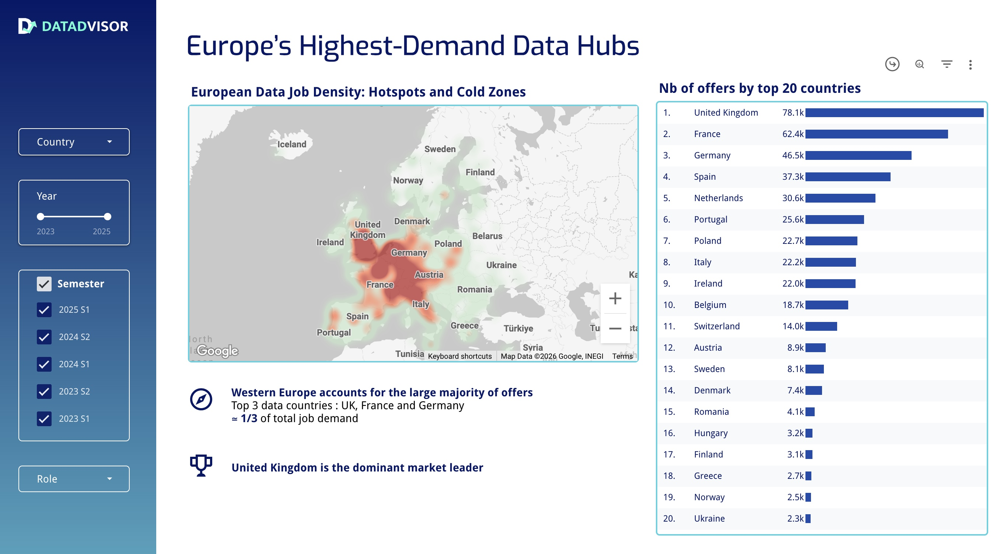
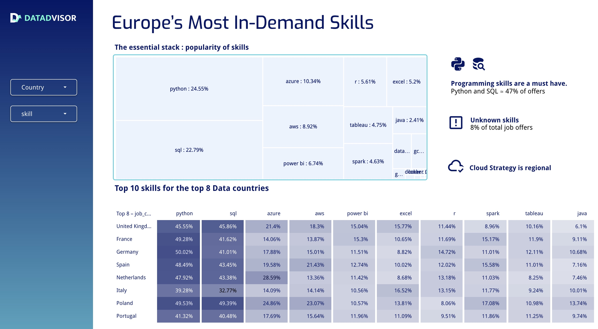

# european-data-job-market-analysis
 analysis of 550k+ European data job postings (2023-2025) using Python, SQL, BigQuery and Looker Studio.

# European Data Job Market Analysis (2023-Q2 2025)

## Project Overview

This project analyzes end-to-end **550k+ European data job postings across 37 countries (2023-mid 2025)**.

Developed as part of a Data Analytics bootcamp, we acted as **Data Advisor Consultants**, delivering insights for a fictional European career coaching agency.

The objective was to understand:
- Market trends
- Skill demand
- Geographic distribution
- Degree requirements
- Emerging patterns in data roles

---

## Business Questions

- Has the European data job market slowed down?
- Which roles dominate the market?
- What are the most in-demand skills?
- Which countries are the strongest data hubs?
- Are degree requirements decreasing?

---

## Hypotheses

- H1: Data job opportunities increase over the years
- H2: Programming skills are a must-have
- H3: Skill demand varies by country
- H4: Advanced roles are linked to degree requirements

---

## Tech Stack

- Python (Pandas, Jupyter)
- SQL (BigQuery)
- Role classification logic (custom rule-based engine)
- Looker Studio (interactive dashboard)
- Git

---

## Data Pipeline

1. Raw job postings loaded from BigQuery
2. Data cleaning and normalization
3. Custom rule-based role classification
4. Skill extraction & aggregation
5. Analytical tables prepared in SQL
6. Interactive dashboard built in Looker Studio

---

## Key Insights

- Significant slowdown in 2024 followed by strong rebound in Q1 2025
- UK, France and Germany are the strongest data hubs
- Python & SQL dominate across all markets
- Degree requirements are decreasing (except for Data Scientist roles)
- Cloud skills (Azure & AWS) are becoming increasingly strategic

---

## Quality Check

A quality report is included in the notebook:
- Distribution of classified roles
- Percentage of "undefined" roles
- Sanity checks on missing values

---

## Dashboard

Public Looker Studio dashboard: *https://lookerstudio.google.com/reporting/015c90fb-fa5e-4f94-8426-91d000ee1336*

Screenshots available in `/dashboard/screenshots/`

---

## ⚠ Dataset Limitations

- No salary data
- Some missing degree indicators
- Role classification based on rule-based logic (not ML)

---

## Future Improvements

- Integrate salary datasets
- Implement ML-based role classification
- Automate pipeline
- Develop skill recommendation model

---

## Dashboard Preview

### Market Volatility

### Role Distribution

### Geographic Hotspots

### Skills Demand

